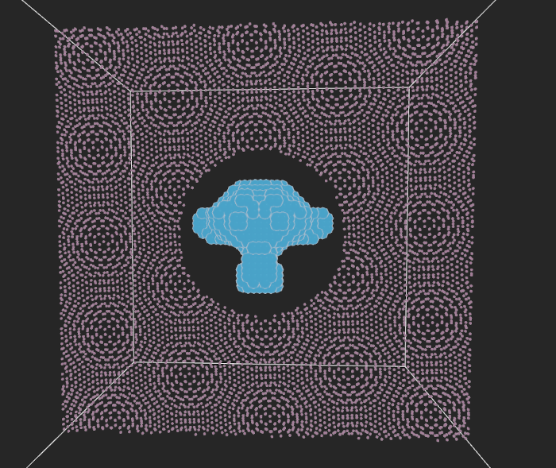

# moleKool

various solutions for molecular dynamics and related fields using **[Kotlin Multiplatform](https://kotlinlang.org/docs/multiplatform.html)**

  

[](https://github.com/nort3x/MoleKool/actions/workflows/gradle-publish.yml)
[](https://search.maven.org/search?q=molekool)

<details>
<summary>
<strong>sample code for above screenshop </strong>
</summary>

```kotlin
fun main() {

    // your world
    val env = Environment()

    // read monkey stl
    val data = STL(STL::class.java.classLoader.getResource("monkey.stl")!!.readBytes())
    val monkeyFace = TriangleMeshClosedSurface(data.triangles)

    // sample inside monkey
    Grid3D(20, 20, 20)
        .points.spanInAllDirections()
        .filter { it isInside monkeyFace }
        .map { it.rotateX(90.toRad()) }
        .map { it.copy(z = -it.z) }
        .map { atomOf(AtomicMass.Fe, it) }
        .forEach { env.add(it) }

    // update box based on monkey face
    env.boundingBox = with(env.enclosingBox) {
        val edgeLen = listOf(xBoundary.length, yBoundary.length, zBoundary.length).max() * 1.5
        Box(-edgeLen to edgeLen, -edgeLen to edgeLen, -edgeLen to edgeLen)
    }

    // sphere to cut out from
    val sphere = Sphere(Point(0, 0, 0), 0.2 * env.enclosingBox.xBoundary.length)

    // a famous grid
    Grid2D(50, 50)
        .points
        .spanInAllDirections()
        .usingCrystal(Crystal.graphene.armchair(1.0))
        .flatMap { listOf(it, it.rotateZ(5.6.toRad())) }
        .filter { it isInside env.boundingBox!! }
        .filter { it isOutside sphere }
        .map { atomOf(AtomicMass.H, it) }
        .forEach { env.add(it) }

    // visualize
    KoolVisualizer()
        .withDefaultConfig()
        .addPlugin(BoxViewerPlugin(env.enclosingBox))
        .init()
        .addEnvironment(env)
        .runAndWaitUntilExit()

}
```

run [this](https://github.com/nort3x/MoleKool/blob/master/examples/src/jvmMain/kotlin/Logo.kt) for yourself from

</details>

---
## Modules

| Name            | Description                                                                                     | Platforms                                                                         |
|-----------------|-------------------------------------------------------------------------------------------------|-----------------------------------------------------------------------------------|
| molekool-core   | base computation for manipulation                                                               | ![badge][badge-jvm] ![badge][badge-js] ![badge][badge-js-ir] ![badge][badge-wasm] |
| molekool-visual | minimal embedded visualization tool based on [kool-engine](https://github.com/kool-engine/kool) | ![badge][badge-jvm] ![badge][badge-js] ![badge][badge-js-ir]                      |
| molekool-bind   | basic integrations with third party tools **experimental**                                      | ![badge][badge-jvm]                                                               |

## Install

#### Gradle

To use this library in your Gradle project, add the following to your `build.gradle(.kts)` file:

```gradle
dependencies {
    // Various generators
    implementation("io.github.nort3x:molekool-core:$molekoolVersion")
    // Using Kool engine to visualize environments
    implementation("io.github.nort3x:molekool-visual:$molekoolVersion")
    // Basic bindings to various MD third-party tools (experimental)
    implementation("io.github.nort3x:molekool-bind:$molekoolVersion")
}
```

Replace `$molekoolVersion` with the latest version of the library.

#### Maven

To use this library in your Maven project, add the following to your `pom.xml` file:

```xml

<dependencies>
    <!-- Various generators -->
    <dependency>
        <groupId>io.github.nort3x</groupId>
        <artifactId>molekool-core</artifactId>
        <version>VERSION</version>
    </dependency>
    <!-- Using Kool engine to visualize environments -->
    <dependency>
        <groupId>io.github.nort3x</groupId>
        <artifactId>molekool-visual</artifactId>
        <version>VERSION</version>
    </dependency>
    <!-- Basic bindings to various MD third-party tools (experimental) -->
    <dependency>
        <groupId>io.github.nort3x</groupId>
        <artifactId>molekool-bind</artifactId>
        <version>VERSION</version>
    </dependency>
</dependencies>
```

Replace `VERSION` with the latest version of the library.


[badge-android]: http://img.shields.io/badge/-android-6EDB8D.svg?style=flat


[badge-android-native]: http://img.shields.io/badge/support-[AndroidNative]-6EDB8D.svg?style=flat

[badge-wearos]: http://img.shields.io/badge/-wearos-8ECDA0.svg?style=flat

[badge-jvm]: http://img.shields.io/badge/-jvm-DB413D.svg?style=flat

[badge-js]: http://img.shields.io/badge/-js-F8DB5D.svg?style=flat

[badge-js-ir]: https://img.shields.io/badge/support-[IR]-AAC4E0.svg?style=flat

[badge-nodejs]: https://img.shields.io/badge/-nodejs-68a063.svg?style=flat

[badge-linux]: http://img.shields.io/badge/-linux-2D3F6C.svg?style=flat

[badge-windows]: http://img.shields.io/badge/-windows-4D76CD.svg?style=flat

[badge-wasm]: https://img.shields.io/badge/-wasm-624FE8.svg?style=flat

[badge-apple-silicon]: http://img.shields.io/badge/support-[AppleSilicon]-43BBFF.svg?style=flat

[badge-ios]: http://img.shields.io/badge/-ios-CDCDCD.svg?style=flat

[badge-mac]: http://img.shields.io/badge/-macos-111111.svg?style=flat

[badge-watchos]: http://img.shields.io/badge/-watchos-C0C0C0.svg?style=flat

[badge-tvos]: http://img.shields.io/badge/-tvos-808080.svg?style=flat
